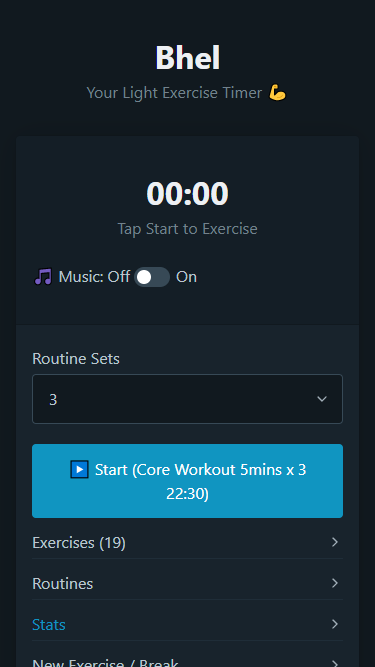
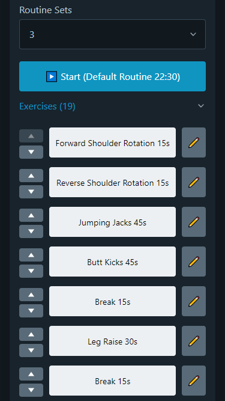
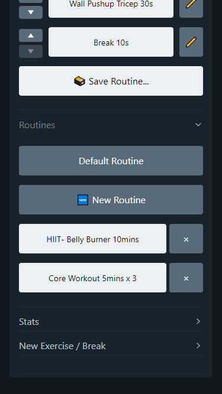
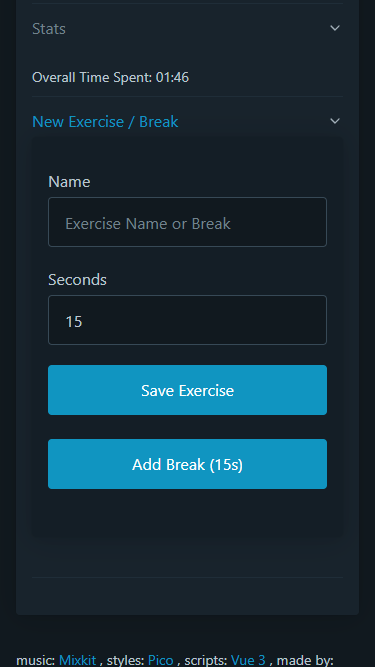

# Bhel
A Minimal Light Exercise Timer 💪⏲

## Table of Contents
* Introduction
* Technologies
* Features
* Roadmap
* Screenshots
* Contribution

## Introduction
Bhel is a light and savoury snack from India, and a type of chaat. It is made of puffed rice, vegetables and a tangy tamarind sauce, and has a crunchy texture    
So a great food metaphor for excercising for individuals who want to loose weight.

## Features
- Added reliable workouts with music to give you a head start.
- Add, reorder and save unlimited new exercises, breaks and workouts.
- Play your own music  or play packaged music from [Mixkit](https://mixkit.co/).
- See Stats of how much time spent exercising.
- Completely private, all the custom or generated workout data stored on your machine & nothing on a server.
- Download and install the [PWA](https://bhel.prikeshsavla.com) to use like an mobile app, compatible with both IOS and Android and Desktop.
- Very Lightweight as promised ~200kb without music and ~1.3MB with music

## Technologies
- [Vue 3](https://github.com/vuejs/)
- [Vite](https://github.com/vitejs/vite)
- [Typescript](https://www.typescriptlang.org/)
- [Pico.css](https://github.com/picocss/pico)
- [Netlify](https://www.netlify.com/)

## Roadmap
  - [x] Exercise Timer
  - [x] Background Music
  - [x] Queued exercise
  - [x] Speak Exercise name
  - [x] Countdown final 5 seconds
  - [x] Keep phone awake ? (Wake lock add, works sometimes)
  - [x] Add exercises
  - [x] Remove exercises
  - [x] Works Offline
  - [ ] ~~Refactor to become event driven~~
  - [x] Exercise / usage analytics (Client side only)
  - [x] Complete v1
  - [x] Move exercises
  - [x] Save custom routines
  - [x] Remove saved routine
  - [ ] ~~Turn exercise to music instead of queues~~
  - [x] Add multiple Sets support
  - [ ] ~~Add Stretch / Warm up and Cool down sections~~
  - [ ] ~~Add counter instead of timer~~
  - [x] Disable Music
  - [ ] ~~Select Music from a dropdown~~
  - [ ] ~~Change Background on Exercise~~
  - [x] Complete v2

## Screenshots

| Home       | Exercise List       |
| -------------- | -------------- |
|  |  |

| Custom Workouts       | Add Exercises       |
| -------------- | -------------- |
|  |  |

## Contribution
Issues and feature suggestions are welcome
